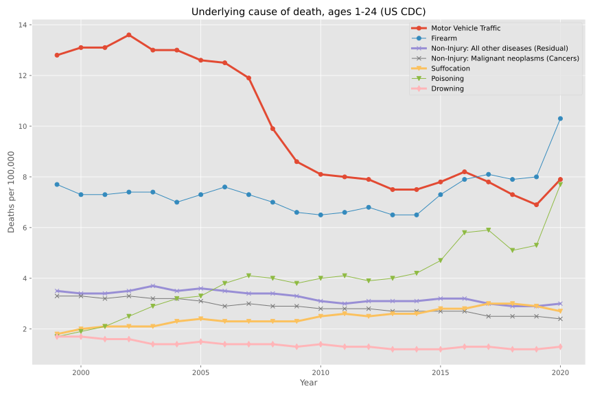
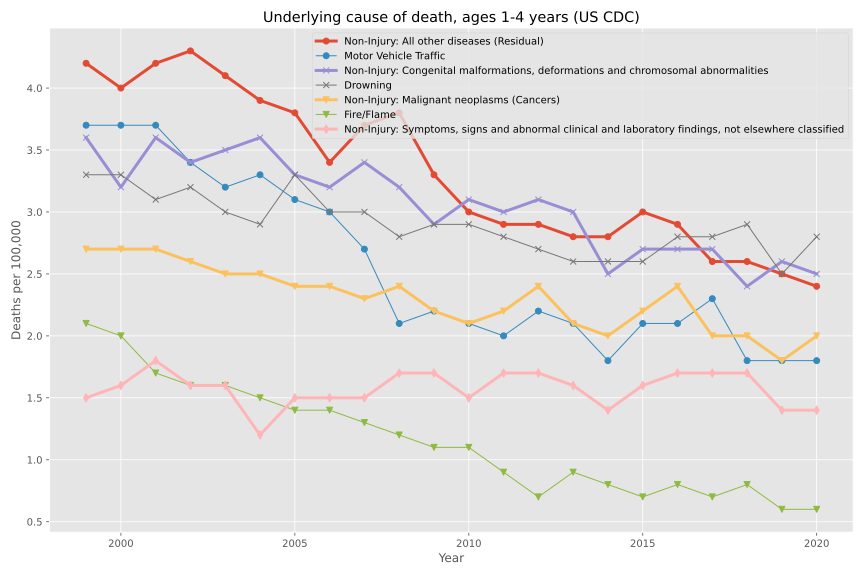
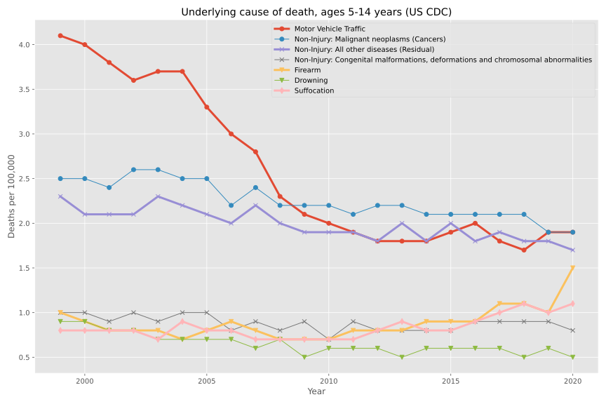

The Economist tweeted this chart of gun vs motor deaths over the last twenty years in the US: https://nitter.it/TheEconomist/status/1529545402818695169

## 1-24 years old

> CDC link: https://wonder.cdc.gov/controller/saved/D76/D292F582

Expanding the Economist's chart (1-24 year old underlying causes of death), this shows the top seven causes of death: motor vehicle, firearm, "all other diseases", cancer, suffocation, poisoning, and drowning.

The motor vehicle line hovered high above everything else from 1999 to 2007 around 12–13.5 deaths per 100,000 but crashed to ~8 since 2010.

Meanwhile, the firearm line has hovered ~8 since 1999 but around 2015 began climbing, exceeding the motor vehicles line around 2017 and as of 2020 sitting above 10 deaths per 100,000.

The other unusual line is poisoning. In 1999 it was the among the lowest, at <2 per 100,000 deaths but has steadily increased and in 2020 spiked to just below 8 (just a tiny bit below motor vehicles).

Most of the other lines show secular downward trends from 3.5 deaths or less, except suffocation which has risen from ~2 to 3 (note that SIDS was recently cured).

## 1-4 years old

> CDC link for this and the remaining charts: https://wonder.cdc.gov/controller/saved/D76/D292F592

A messy chart of the top seven causes of death in the US for ages 1-4 years old. All lines are <4.5 deaths per 100,000 and are all falling: "all other diseases", motor vehicles, congenital birth defects, drowning, cancer, fire, and "other" abnormal clinical non-injury deaths. By 2020, the leading cause of death was drowning at <3 deaths per 100,000.

This is a good thing: child mortality in the US has been steadily falling as education and parenting support has improved.

## 5-14 years old

A banger chart of causes of death, 5-14 years old.

There are three groups of lines.

Like the 1-4 years old, the worst line began at ~4 deaths per 100,000 in the late 90s. That was motor vehicle deaths. It has crashed to <2 deaths per 100,000.

The next bundle has two lines: cancer and "other" diseases that began at ~2.5 in 1999 and have gently fallen to <2 per 100,000, both close to motor vehicle deaths.

Then the last bundle is four other causes of death (congenital defects, firearm, drowning, and suffocation), around 0.75 to 1 death per 100,000, largely flat over the decades, though suffocation has risen above 1 last couple of years, and very worryingly, firearms have shot up to 1.5 deaths per 100,000.

This is on the whole good news compared to the original Economist chart. Most kids and early teens don't die in the US.

But the steady rise in firearm deaths since 2017 is worrying.

## 15-24 years old

Dramatic chart of causes of deaths for 15-24 year olds.

Motor vehicle deaths was the #1 killer at 25 to 27 deaths per 100,000 in the early 2000s. It has crashed to ~15 starting in the late 2000s.

Firearm deaths is the next very worrying cause of death. It slowly descended from 17 to 14 deaths per 100,000 from 1999 to 2014 but since then has been relentlessly rising to 22 in 2020, exceeding motor vehicles every year since 2015.

The other worrying trend is #3, poisoning, which was one of the lowest lines in the chart in 1999 but has steadily increased from ~4 to 17 in 2020, beating motor vehicle deaths in 2020.

The other four lines ("all other diseases", cancer, suffocation, and heart disease") are all between 2~5 deaths per 100,000.

## Firearms: injury intent (homicide, suicide, etc)

> CDC link for data: https://wonder.cdc.gov/controller/saved/D76/D292F612

The firearms line of the first chart broken down into all the injury intents. Roughly twice as many homicides as suicides over much of the data horizon, but worryingly suicides bottomed in 2007 at 2 deaths per 100,000 and have steadily increased to 3.5 in 2020. Meanwhile, homicides bottomed much later, in 2014, at less than 4 deaths per 100,000 and in 2020 were ~6.5.

Meanwhile unintentional firearm deaths are quite rare (less than 0.3 deaths per 100,000).
